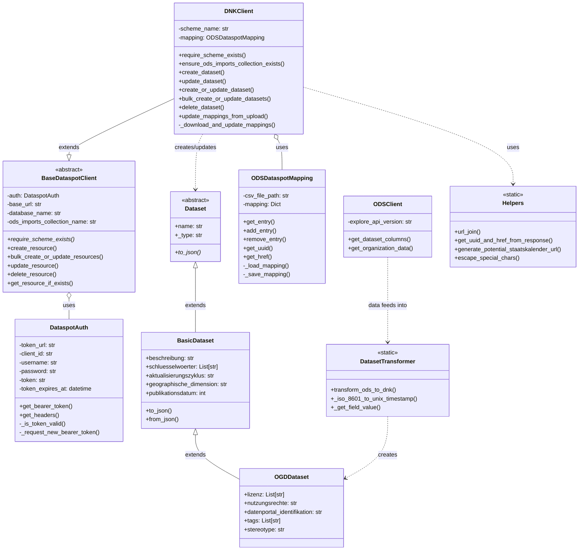

# README.md

## How to do regular updates (not yet implemented):
<!-- Frequent updates of details of already published datasets (e.g. last_updated field) are not updated directly through dataspot. but instead through a file managed by the Data Competence Center DCC. This means that fields that should be updated outside of the workflow are written to the centrally managed file instead of dataspot directly. These changes are then regularly updated by a script from the DCC to dataspot. The key should always be the dataspot-internal UUID. Dates should be provided as Unix timestamps in in UTC timezone. Times should be provided in Unix timestamps aswell in a ??? format (TBD; the same as is used internally in dataspot.). TODO: Add examples -->

Frequent updates of details of already published datasets (e.g. last_updated field) are not updated directly through dataspot, as this does not work with the workflow. Instead, the changes are pushed to a non-public dataset on [opendatasoft](data.bs.ch). Please [get in touch](mailto:opendata@bs.ch) with us for the setup.

The columns should be (so far): uuid,lastactl,lastpub

This is put on hold for the moment, as lastactl does not really need to be in dataspot. (?)

## How to integrate an `int` environment into `prod` (work-in-progress)
When integrating a `dev` into `prod`, first we need to clone the `dev` into an `int`. 
Then:
1. Integrate yaml
1. Run job "Regelverletzungen prüfen"
1. Export DNK as xlsx and import it again (dry run is enough)
1. Export and reimport other models that might be affected aswell

If everything worked without errors, we can apply the `int` yaml into the `prod` yaml and reapply the changes made to the `int` to the `prod`.

After that, delete the `dev` branch on github, in dataspot, and also its corresponding Annotations.yaml

## Notes (Renato)
### Colors for top bar background:
Not explicitely defined, this is written here just so that I know what I used before. You can use whatever you want.
- dev: 167a3e
- int: ff0000

## System Architecture Overview

This project facilitates data synchronization between OpenDataSoft (ODS) and Dataspot's Datennutzungskatalog (DNK). Below is a UML diagram showing the main components and their relationships:

### Key Components:

1. **Authentication (DataspotAuth)**: Handles OAuth token management for Dataspot API access.

2. **Clients**:
   - **BaseDataspotClient**: Abstract base class providing common functionality for Dataspot API interaction.
   - **DNKClient**: Extends BaseDataspotClient to specifically work with the Datennutzungskatalog (DNK).
   - **ODSClient**: Interfaces with the OpenDataSoft API to retrieve dataset information.

3. **Data Models**:
   - **Dataset**: Abstract base class for all dataset types.
   - **BasicDataset**: Extends Dataset with basic metadata fields.
   - **OGDDataset**: Extends BasicDataset with Open Government Data specific fields.

4. **Mapping (ODSDataspotMapping)**: Maintains a persistent mapping between ODS dataset IDs and Dataspot UUIDs/hrefs in a CSV file.

5. **Transformation (DatasetTransformer)**: Contains functions to convert ODS metadata format to Dataspot DNK format.

6. **Helpers**: Utility functions for URL manipulation, response parsing, and special character handling.

### Data Flow:

1. The process begins with fetching dataset metadata from OpenDataSoft using ODSClient.
2. This metadata is transformed into Dataspot's format using functions in DatasetTransformer.
3. The DNKClient uses ODSDataspotMapping to track relationships between systems.
4. DNKClient creates, updates, or deletes datasets in Dataspot's DNK, with each operation requiring authentication via DataspotAuth.
5. For bulk operations, multiple datasets can be processed in a single API call.

This architecture enables synchronization of datasets between OpenDataSoft and Dataspot while maintaining a mapping between the two systems.
