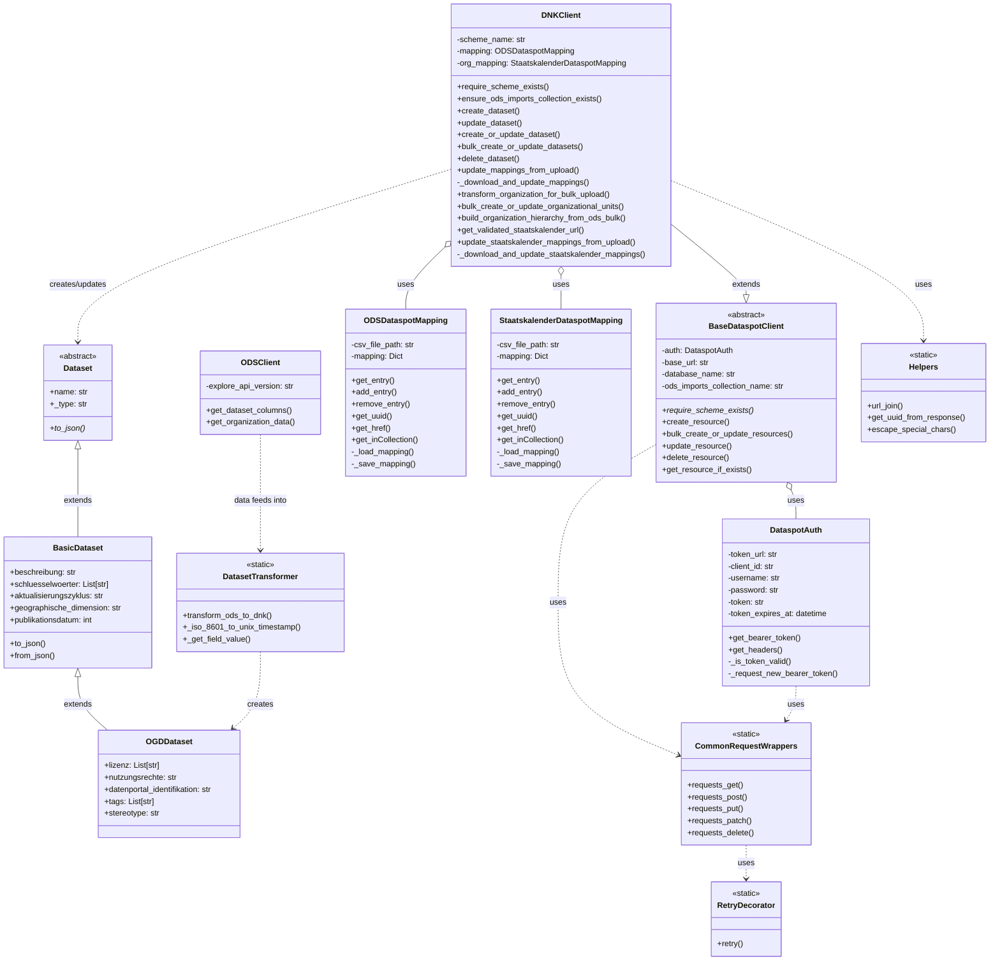

## System Architecture Overview

This project facilitates data synchronization between OpenDataSoft (ODS) and Dataspot's Datennutzungskatalog (DNK). Below is a UML diagram showing the main components and their relationships:

### Key Components:

1. **Authentication (DataspotAuth)**: Handles OAuth token management for Dataspot API access.

2. **Clients**:
   - **BaseDataspotClient**: Abstract base class providing common functionality for Dataspot API interaction.
   - **DNKClient**: Extends BaseDataspotClient to specifically work with the Datennutzungskatalog (DNK). Handles both dataset and organizational unit operations.
   - **ODSClient**: Interfaces with the OpenDataSoft API to retrieve dataset information.

3. **Data Models**:
   - **Dataset**: Abstract base class for all dataset types.
   - **BasicDataset**: Extends Dataset with basic metadata fields.
   - **OGDDataset**: Extends BasicDataset with Open Government Data specific fields.

4. **Mapping**:
   - **ODSDataspotMapping**: Maintains a persistent mapping between ODS dataset IDs and Dataspot UUIDs/hrefs in a CSV file.
   - **StaatskalenderDataspotMapping**: Maintains a persistent mapping between Staatskalender organization IDs and Dataspot UUIDs/hrefs.

5. **HTTP Utilities**:
   - **CommonRequestWrappers**: Provides standardized HTTP request functions with consistent error handling.
   - **RetryDecorator**: Implements retry logic for HTTP requests that may experience transient failures.

6. **Transformation (DatasetTransformer)**: Contains functions to convert ODS metadata format to Dataspot DNK format.

7. **Helpers**: Utility functions for URL manipulation, response parsing, and special character handling.

### Data Flow:

1. **Dataset Synchronization**:
   - The process begins with fetching dataset metadata from OpenDataSoft using ODSClient.
   - This metadata is transformed into Dataspot's format using functions in DatasetTransformer.
   - The DNKClient uses ODSDataspotMapping to track relationships between systems.
   - DNKClient creates, updates, or deletes datasets in Dataspot's DNK, with each operation requiring authentication via DataspotAuth.
   - For bulk operations, multiple datasets can be processed in a single API call.

2. **Organizational Unit Synchronization**:
   - Organization data is retrieved from OpenDataSoft.
   - DNKClient transforms the flat organization data into a hierarchical structure.
   - The hierarchical data is uploaded to Dataspot level by level to preserve parent-child relationships.
   - StaatskalenderDataspotMapping is used to track the mapping between Staatskalender IDs and Dataspot UUIDs.

This architecture enables synchronization of both datasets and organizational units between OpenDataSoft and Dataspot while maintaining mappings between the systems.

### Note on Debugging Code

The repository contains a `renato_debugging.py` file which is not part of the core system architecture. This file contains temporary debugging code and should not be considered part of the production system.
