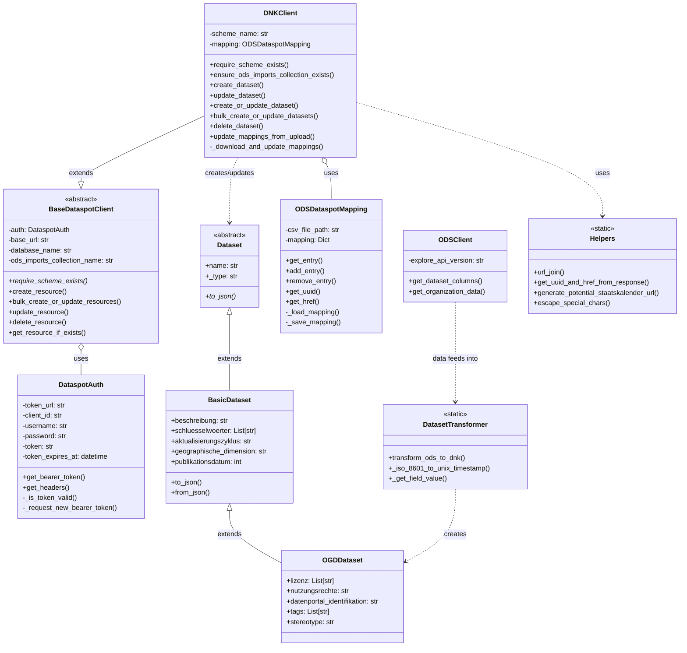

## System Architecture Overview

This project facilitates data synchronization between OpenDataSoft (ODS) and Dataspot's Datennutzungskatalog (DNK). Below is a UML diagram showing the main components and their relationships:

### Key Components:

1. **Authentication (DataspotAuth)**: Handles OAuth token management for Dataspot API access.

2. **Clients**:
   - **BaseDataspotClient**: Abstract base class providing common functionality for Dataspot API interaction.
   - **DNKClient**: Extends BaseDataspotClient to specifically work with the Datennutzungskatalog (DNK).
   - **ODSClient**: Interfaces with the OpenDataSoft API to retrieve dataset information.

3. **Data Models**:
   - **Dataset**: Abstract base class for all dataset types.
   - **BasicDataset**: Extends Dataset with basic metadata fields.
   - **OGDDataset**: Extends BasicDataset with Open Government Data specific fields.

4. **Mapping (ODSDataspotMapping)**: Maintains a persistent mapping between ODS dataset IDs and Dataspot UUIDs/hrefs in a CSV file.

5. **Transformation (DatasetTransformer)**: Contains functions to convert ODS metadata format to Dataspot DNK format.

6. **Helpers**: Utility functions for URL manipulation, response parsing, and special character handling.

### Data Flow:

1. The process begins with fetching dataset metadata from OpenDataSoft using ODSClient.
2. This metadata is transformed into Dataspot's format using functions in DatasetTransformer.
3. The DNKClient uses ODSDataspotMapping to track relationships between systems.
4. DNKClient creates, updates, or deletes datasets in Dataspot's DNK, with each operation requiring authentication via DataspotAuth.
5. For bulk operations, multiple datasets can be processed in a single API call.

This architecture enables synchronization of datasets between OpenDataSoft and Dataspot while maintaining a mapping between the two systems.
