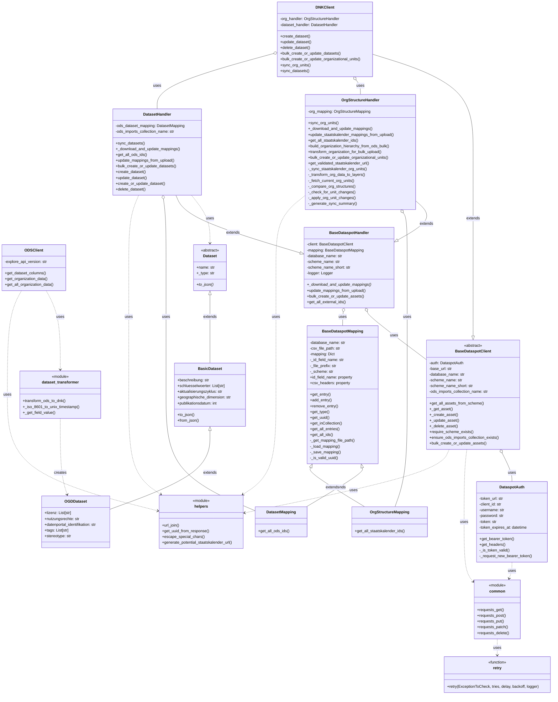

## System Architecture Overview

This project facilitates data synchronization between OpenDataSoft (ODS) and Dataspot's Datennutzungskatalog (DNK). Below is a UML diagram showing the main components and their relationships:

### Key Components:

1. **Authentication (DataspotAuth)**: Handles OAuth token management for Dataspot API access.

2. **Clients**:
   - **BaseDataspotClient**: Abstract base class providing common functionality for Dataspot API interaction.
   - **DNKClient**: Extends `BaseDataspotClient` to specifically work with the Datennutzungskatalog (DNK). Delegates handling to specialized handlers.
   - **ODSClient**: Interfaces with the OpenDataSoft API to retrieve dataset and organization information.

3. **Handlers**:
   - **BaseDataspotHandler**: Abstract base class for handlers that manage different types of assets in Dataspot.
   - **DatasetHandler**: Extends `BaseDataspotHandler` to handle dataset synchronization operations.
   - **OrgStructureHandler**: Extends `BaseDataspotHandler` to handle organizational unit synchronization operations.

4. **Data Models**:
   - **Dataset**: Abstract base class for all dataset types.
   - **BasicDataset**: Extends Dataset with basic metadata fields.
   - **OGDDataset**: Extends BasicDataset with Open Government Data specific fields.

5. **Mapping**:
   - **BaseDataspotMapping**: Base class providing mapping functionality for external IDs to Dataspot UUIDs.
   - **DatasetMapping**: Extends BaseDataspotMapping to specifically map ODS dataset IDs to Dataspot UUIDs.
   - **OrgStructureMapping**: Extends BaseDataspotMapping to map Staatskalender organization IDs to Dataspot UUIDs.

6. **HTTP Utilities**:
   - **common**: Module providing standardized HTTP request functions with consistent error handling.
   - **retry**: Decorator function implementing retry logic for HTTP requests that may experience transient failures.

7. **Utility Modules**:
   - **helpers**: Module containing utility functions for URL manipulation, response parsing, and special character handling.
   - **dataset_transformer**: Module containing functions to convert ODS metadata format to Dataspot DNK format.

### Data Flow:

1. **Dataset Synchronization**:
   - The process begins with fetching dataset metadata from OpenDataSoft using ODSClient.
   - This metadata is transformed into Dataspot's format using functions in the dataset_transformer module.
   - The DNKClient delegates operations to DatasetHandler, which uses DatasetMapping to track relationships between systems.
   - DatasetHandler creates, updates, or deletes datasets in Dataspot's DNK, with each operation requiring authentication via DataspotAuth.
   - For bulk operations, multiple datasets can be processed in a single API call.

2. **Organizational Unit Synchronization**:
   - Organization data is retrieved from OpenDataSoft via ODSClient.
   - DNKClient delegates operations to OrgStructureHandler, which transforms the flat organization data into a hierarchical structure.
   - The hierarchical data is uploaded to Dataspot level by level to preserve parent-child relationships.
   - OrgStructureMapping is used to track the mapping between Staatskalender IDs and Dataspot UUIDs.

This architecture enables synchronization of both datasets and organizational units between OpenDataSoft and Dataspot while maintaining mappings between the systems.

### Note on Debugging Code

The repository contains a `renato_debugging.py` file which is not part of the core system architecture. This file contains temporary debugging code and should not be considered part of the production system.
