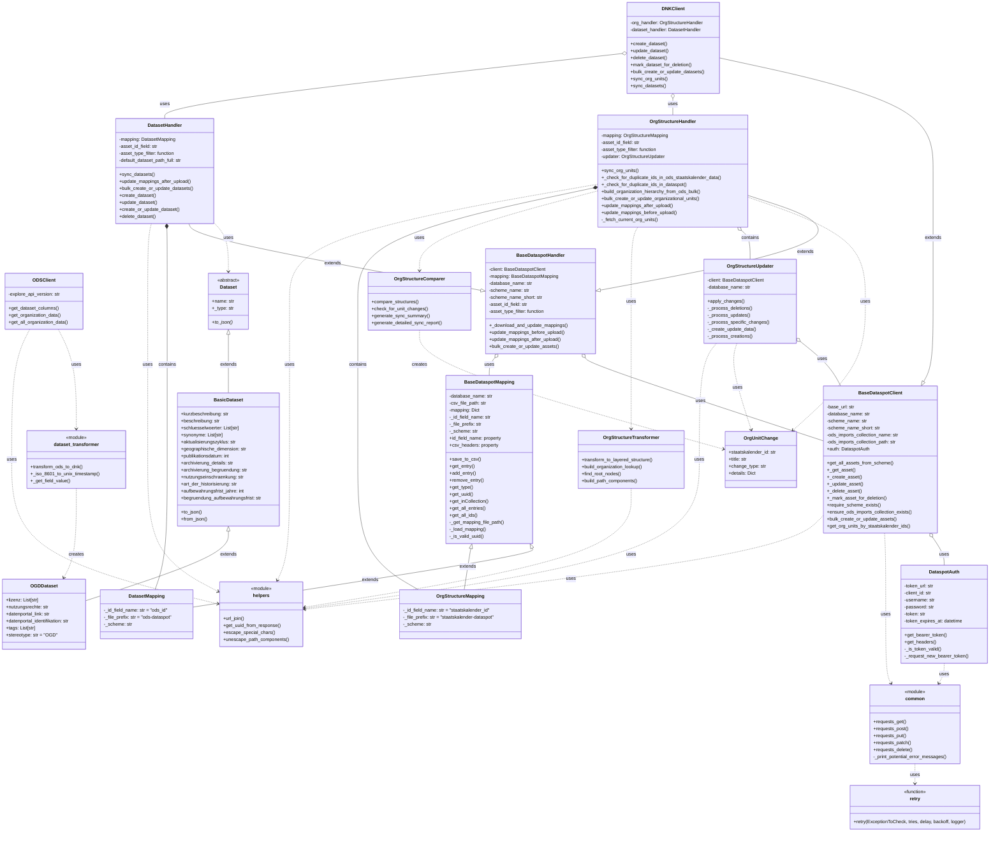

## System Architecture Overview

This project helps keep data in sync between OpenDataSoft (ODS) and Dataspot's Datennutzungskatalog (DNK). The diagram below shows the main parts of the system and how they connect.

### Key Components:

1. **Authentication (DataspotAuth)**: Handles OAuth token management for Dataspot API access.

2. **Clients**:
   - **BaseDataspotClient**: Base class providing common functionality for Dataspot API interaction.
   - **DNKClient**: Extends `BaseDataspotClient` to specifically work with the Datennutzungskatalog (DNK). Delegates handling to specialized handlers.
   - **ODSClient**: Interfaces with the OpenDataSoft API to retrieve dataset and organization information.

3. **Handlers**:
   - **BaseDataspotHandler**: Base class for handlers that manage different types of assets in Dataspot.
   - **DatasetHandler**: Extends `BaseDataspotHandler` to handle dataset synchronization operations. Contains the `DatasetMapping` class for managing ODS ID to Dataspot UUID mappings.
   - **OrgStructureHandler**: Extends `BaseDataspotHandler` to handle organizational unit synchronization operations. Contains the `OrgStructureMapping` class for managing Staatskalender ID to Dataspot UUID mappings. Uses specialized helper classes for different aspects of organizational structure management.

4. **Org Structure Helpers**:
   - **OrgStructureTransformer**: Handles transformation of organizational structure data between different formats, particularly from ODS to Dataspot format.
   - **OrgStructureComparer**: Compares organizational structures and identifies changes needed, generating OrgUnitChange objects.
   - **OrgStructureUpdater**: Handles applying changes to organizational units in Dataspot, processing creations, updates, and deletions.
   - **OrgUnitChange**: Named tuple class used to track changes to organizational units during synchronization.

5. **Data Models**:
   - **Dataset**: Abstract base class for all dataset types.
   - **BasicDataset**: Extends Dataset with basic metadata fields.
   - **OGDDataset**: Extends BasicDataset with Open Government Data specific fields.

6. **Mapping**:
   - **BaseDataspotMapping**: Base class providing mapping functionality for external IDs to Dataspot UUIDs.
   - **DatasetMapping**: Extends BaseDataspotMapping to specifically map ODS dataset IDs to Dataspot UUIDs.
   - **OrgStructureMapping**: Extends BaseDataspotMapping to map Staatskalender organization IDs to Dataspot UUIDs.

7. **HTTP Utilities**:
   - **common**: Module providing standardized HTTP request functions with consistent error handling.
   - **retry**: Decorator function implementing retry logic for HTTP requests that may experience transient failures.

8. **Utility Modules**:
   - **helpers**: Module containing utility functions for URL manipulation, response parsing, and special character handling.
   - **dataset_transformer**: Module containing functions to convert ODS metadata format to Dataspot DNK format.

### Data Flow:

1. **Dataset Synchronization**:
   - The process begins with fetching dataset metadata from OpenDataSoft using ODSClient.
   - This metadata is transformed into Dataspot's format using functions in the dataset_transformer module.
   - The DNKClient delegates operations to DatasetHandler, which uses its internal DatasetMapping to track relationships between systems.
   - DatasetHandler creates, updates, or deletes datasets in Dataspot's DNK, with each operation requiring authentication via DataspotAuth.
   - For bulk operations, multiple datasets can be processed in a single API call.

2. **Organizational Unit Synchronization**:
   - Organization data is retrieved from OpenDataSoft via ODSClient.
   - DNKClient delegates operations to OrgStructureHandler, which orchestrates the synchronization process.
   - OrgStructureTransformer converts flat organization data into a hierarchical structure.
   - OrgStructureComparer identifies differences between source and current organizational structures.
   - OrgStructureUpdater applies identified changes to Dataspot.
   - OrgStructureHandler uses its internal OrgStructureMapping to maintain mappings between Staatskalender IDs and Dataspot UUIDs.
   - OrgUnitChange instances track creations, updates, and deletions of organizational units during synchronization.

This architecture enables synchronization of both datasets and organizational units between OpenDataSoft and Dataspot while maintaining mappings between the systems.

### Directory Structure

The source code follows this organization:
- `src/`
  - `clients/`: Contains client implementations for different services
  - `common/`: Contains shared utility functions
  - `mapping_handlers/`: Contains handlers for various types of data mapping
    - `org_structure_helpers/`: Contains specialized components for organizational structure handling
  - Core modules like dataset models and transformers

### Note on Debugging Files

The repository contains debugging and temporary files such as `renato_debugging.py` and various `todos_*.txt` files which are not part of the core system architecture. These files contain temporary debugging code and should not be considered part of the production system.
